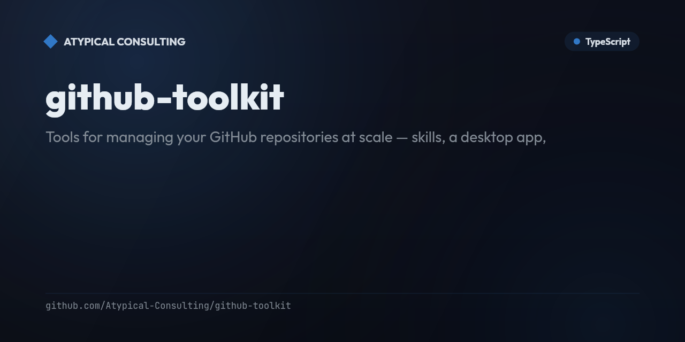

# GitHub Toolkit

> Tools for **managing your GitHub repositories at scale** — skills, a desktop app,
> a Renovate CLI, and a DevOps sync — consolidated in one place (full git history preserved).

## Tools

| Path | What it is | From |
|---|---|---|
| [`skills/`](skills) | **Claude Code skills** for auditing, managing and improving repositories | `Atypical-Consulting/GitHubSkills` ★ |
| [`automate/`](automate) | A **Tauri desktop app** for automating GitHub workflows | `Atypical-Consulting/GitHubAutomate` |
| [`repo-tools/`](repo-tools) | A **Spectre CLI** to manage Renovate configurations across repos, with caching and interactive multi-select | `phmatray/GitHubRepoTools` |
| [`devhub-sync/`](devhub-sync) | Synchronize repositories **between Azure DevOps and GitHub** via a Blazor Server UI | `phmatray/DevHubSync` |

## Features

- **Four complementary tools** — each solves a different repo-management chore
- **Mixed stacks** — Claude Code skills, TypeScript/Tauri, and .NET/C#
- **One home** — shared issues, discussions and history for all your GitHub tooling

## Usage

Each tool is self-contained in its folder — open it and follow its own README.

```bash
git clone https://github.com/Atypical-Consulting/github-toolkit.git
cd github-toolkit/repo-tools   # or skills / automate / devhub-sync
```

## History

Each folder was merged with **full git history preserved** (`git subtree`). The
original repositories are archived and redirect here.

## License

MIT — see [`LICENSE`](LICENSE).
