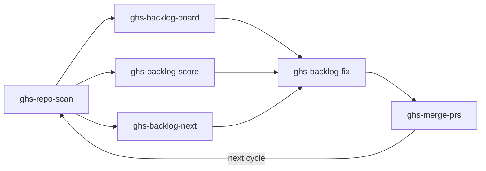
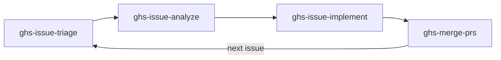

# GitHubSkills

> **Your repos deserve better. GHS fixes them.**

<!-- Badges: Row 1 — Identity -->
[](https://github.com/Atypical-Consulting/GitHubSkills)
[](LICENSE)
[](https://github.com/Atypical-Consulting/GitHubSkills)
[](https://github.com/Atypical-Consulting/GitHubSkills)

<!-- Badges: Row 2 — Activity -->
[](https://github.com/Atypical-Consulting/GitHubSkills/issues)
[](https://github.com/Atypical-Consulting/GitHubSkills/pulls)
[](https://github.com/Atypical-Consulting/GitHubSkills/commits/main)

A collection of [Claude Code](https://docs.anthropic.com/en/docs/claude-code) skills that audit, manage, and improve your GitHub repositories — automatically.

---

## Table of Contents

- [The Problem](#the-problem)
- [The Solution](#the-solution)
- [Features](#features)
  - [Health Loop](#health-loop)
  - [Issue Loop](#issue-loop)
  - [Additional Skills](#additional-skills)
- [Tech Stack](#tech-stack)
- [Workflows](#workflows)
- [Getting Started](#getting-started)
- [Usage](#usage)
- [Architecture](#architecture)
- [Roadmap](#roadmap)
- [Stats](#stats)
- [Contributing](#contributing)
- [License](#license)

## The Problem

Managing repository quality at scale is tedious. Every repo needs a LICENSE, CI, branch protection, CODEOWNERS, templates, security policies — and keeping track of what's missing across dozens of repos is a manual nightmare. Existing linters check code style, but nobody checks whether your repo itself is well-maintained.

## The Solution

**GitHubSkills** automates the audit-fix-sync cycle with Claude Code skills that scan, score, and fix repos. Just say `scan my repo` and GHS will audit best practices, rank findings by impact, apply fixes in parallel worktrees, and open PRs — all from natural language.

```
> scan my repo
  Scanning Atypical-Consulting/MyProject...
  [PASS] LICENSE exists
  [FAIL] No CODEOWNERS file
  [WARN] Branch protection not configured
  Health Score: 72/100 (15 items found)
```

## Features

### Health Loop

*scan -> board / score / next -> fix -> merge*

| Skill | Description |
|-------|-------------|
| `ghs-repo-scan` | Scan a repository for quality best practices and open issues, produce a scored report |
| `ghs-backlog-board` | Show a dashboard of all backlog items across audited repos with scores and progress |
| `ghs-backlog-score` | Calculate and display the health score for a repository |
| `ghs-backlog-next` | Recommend the highest-impact next item to fix |
| `ghs-backlog-fix` | Apply backlog item fixes using parallel worktree-based agents, create PRs |
| `ghs-backlog-sync` | Sync health backlog items to GitHub Issues for team visibility |
| `ghs-merge-prs` | Merge open PRs with CI-aware confirmation and batch support |

### Issue Loop

*triage -> analyze -> implement -> merge*

| Skill | Description |
|-------|-------------|
| `ghs-issue-triage` | Verify and apply proper labels to GitHub issues |
| `ghs-issue-analyze` | Deep-analyze a GitHub issue and post a structured analysis comment |
| `ghs-issue-implement` | Implement a GitHub issue using worktree-based agents, create a PR |
| `ghs-merge-prs` | Merge open PRs with CI-aware confirmation and batch support |

### Additional Skills

| Skill | Description |
|-------|-------------|
| `ghs-profile` | Display a full 360-degree view of a GitHub user profile |
| `ghs-action-fix` | Fix failing GitHub Actions pipelines directly — detect, diagnose, fix, and PR |

## Tech Stack

| Layer | Technology |
|-------|-----------|
| AI Agent | [Claude Code](https://docs.anthropic.com/en/docs/claude-code) |
| GitHub API | [`gh` CLI](https://cli.github.com/) |
| Scripting | Bash, Python |
| Data Format | Structured Markdown (backlog items, reports) |

## Workflows

### Health Loop



### Issue Loop



## Getting Started

### Prerequisites

| Tool | Purpose |
|------|---------|
| [Claude Code](https://docs.anthropic.com/en/docs/claude-code) | AI coding agent that runs the skills |
| [`gh` CLI](https://cli.github.com/) | GitHub API interactions (must be authenticated) |

### Installation

```bash
git clone https://github.com/Atypical-Consulting/GitHubSkills.git
cd GitHubSkills
claude
```

## Usage

### Typical Workflow

**Step 1 — Scan a repo to discover health findings and open issues:**

```
scan my repo
```

**Step 2 — View the backlog board to see all findings ranked by impact:**

```
show my backlog board
```

**Step 3 — Fix the highest-impact items automatically:**

```
fix my backlog
```

GHS clones the target repo, creates worktrees, launches parallel agents to apply fixes, verifies acceptance criteria, and opens PRs — all from a single command.

### Other Examples

```
# Get the health score for a specific repo
score Atypical-Consulting/MyProject

# Triage and label open issues
triage issues

# Analyze a specific issue in depth
analyze issue #42

# Fix a failing CI pipeline
fix actions
```

## Architecture

### Project Structure

```
GitHubSkills/
├── .claude/skills/              # Skill definitions (SKILL.md files)
│   ├── ghs-repo-scan/          # Health scanning skill
│   ├── ghs-backlog-board/      # Dashboard skill
│   ├── ghs-backlog-fix/        # Auto-fix skill
│   ├── ghs-issue-triage/       # Issue labeling skill
│   ├── ghs-issue-analyze/      # Issue analysis skill
│   ├── ghs-issue-implement/    # Issue implementation skill
│   └── shared/references/      # Shared reference docs
├── backlog/                     # Backlog items per repo
│   └── {owner}_{repo}/
│       ├── SUMMARY.md           # Unified repo summary
│       ├── health/              # Health check findings
│       └── issues/              # Open GitHub issues
└── repos/                       # Local clones (gitignored)
```

## Roadmap

- [ ] Expand health checks (dependency audits, secret scanning, code coverage)
- [ ] Increase auto-fix coverage for more finding types
- [ ] CI integration — run scans as GitHub Actions
- [ ] Org-wide dashboards — aggregate scores across all repos
- [ ] Custom rule definitions — let users add their own health checks
- [ ] Scheduled re-scans with drift detection

> Want to contribute? Pick any roadmap item and open a PR!

## Stats

<!-- Get your hash from https://repobeats.axiom.co -->


## Contributing

Contributions are welcome! Please read [CONTRIBUTING.md](CONTRIBUTING.md) first.

1. Fork the repository
2. Create your feature branch (`git checkout -b feature/amazing-feature`)
3. Commit using [conventional commits](https://www.conventionalcommits.org/) (`git commit -m 'feat: add amazing feature'`)
4. Push to the branch (`git push origin feature/amazing-feature`)
5. Open a Pull Request

## License

[MIT](LICENSE) © 2025 [Atypical Consulting](https://atypical.garry-ai.cloud)

---

Built with care by [Atypical Consulting](https://atypical.garry-ai.cloud) — opinionated, production-grade open source.

[](https://github.com/Atypical-Consulting/GitHubSkills/graphs/contributors)
