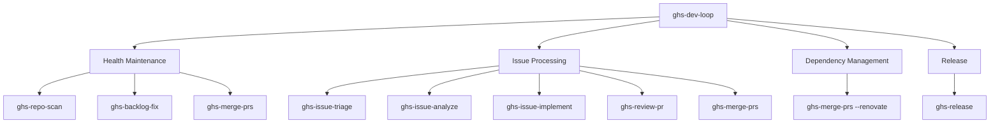

# ghs-dev-loop

Act as an autonomous developer for a repository --- triage, analyze, implement, review, merge, and release in priority-driven cycles.

::: info Skill Info
**Version:** 1.0.0
**Arguments:** `[owner/repo] [--budget <N>] [--cycle single|continuous] [--include-health] [--include-deps]`
**Trigger phrases:** "dev loop", "be my developer", "autonomous developer", "work on my repo", "process all issues", "developer mode", "full dev loop", "maintain this repo", "handle everything", "automate development", "dev cycle"
:::

## What It Does

`ghs-dev-loop` replaces a human developer for a single repository. It processes work in priority-driven cycles: health maintenance, issue triage/analysis/implementation, code review, PR merging, dependency updates, and optional releases. Each cycle enforces human checkpoints for irreversible operations.

### How It Differs from ghs-orchestrate

| Skill | Scope | Focus |
|-------|-------|-------|
| `ghs-orchestrate` | Multi-repo pipeline | Health maintenance across repos |
| `ghs-dev-loop` | Single-repo developer | Full issue lifecycle + health |

### Scope Boundary

**Orchestrates only** --- never directly modifies code. All mutations flow through existing skills.

### Skill Dependency Map



### Priority Queue

| Priority | Category | Trigger |
|----------|----------|---------|
| P0 | Health critical | Health score < 50% |
| P1 | Critical bugs | `priority:critical` label |
| P2 | Health maintenance | Health score < 80% |
| P3 | High-priority issues | `priority:high` label |
| P4 | Normal issues | `priority:medium`, `priority:low`, or unlabeled |
| P5 | Dependencies | Renovate/bot PRs pending |
| P6 | Release | Configured threshold met + `--auto-release` |

### Cycle Modes

| Mode | Behavior | Use When |
|------|----------|----------|
| `single` | Run one cycle, then stop | Manual invocation, testing |
| `continuous` | Repeat until no work remains | Batch processing backlog |
| `watch` | Poll for new issues at interval | Long-running maintenance |

### Checkpoint Gates

| Gate | Default | Can Disable? | Why |
|------|---------|-------------|-----|
| Before health fix | ON | Yes (`--no-checkpoint`) | Fixes create PRs |
| Before implement (High+) | ON | **No** | Complex changes need sign-off |
| Before merge | ON | Yes (`--auto-merge`) | Merging is irreversible |
| Before release | ON | **No** | Releases are public and versioned |

### Process (Per Cycle)

1. **Pre-flight** --- Auth, repo access, write permission, GSD, skill availability
2. **Load state** --- Read state issue (GitHub Issue with `ghs:state` label), offer resume or fresh start
3. **Priority assessment** --- Health score, issue inventory, dependency PRs
4. **Health maintenance** --- If score < threshold: scan, fix, merge
5. **Issue processing** --- For each issue (up to budget): triage, analyze, implement, review, merge
6. **Dependency management** --- Review and merge Renovate/bot PRs
7. **Release decision** --- If criteria met and `--auto-release`: draft release + checkpoint
8. **Cycle report** --- Health delta, issues processed, PRs created/merged
9. **State update** --- Write session entry to state issue (`ghs:state` GitHub Issue)
10. **Next cycle** --- Stop, continue, or poll based on mode

### Flags

| Flag | Default | Effect |
|------|---------|--------|
| `--budget N` | 5 | Max issues per cycle |
| `--continuous` | off | Repeat cycles until empty |
| `--watch INTERVAL` | off | Poll for new issues |
| `--auto-merge` | off | Skip merge checkpoint (non-High+ PRs) |
| `--auto-release` | off | Enable release step (still checkpointed) |
| `--no-checkpoint` | off | Disable optional checkpoints |
| `--health-threshold N` | 80 | Score % below which maintenance triggers |
| `--skip-health` | off | Skip health maintenance |
| `--skip-dependencies` | off | Skip bot PR merging |

## Example

```
## Dev Loop: Cycle #1 --- phmatray/Formidable

### Health
  Score: 65% -> 82% (+17%)
  Fixed: 3 items (2 Tier 1, 1 Tier 2)
  PRs: #45, #46, #47 (merged)

### Issues Processed (4/5 budget)

| # | Issue | Action | Result | PR |
|---|-------|--------|--------|----|
| #12 | Login crash | Implement | [PASS] | #49 (merged) |
| #15 | Dark mode toggle | Implement | [PASS] | #50 (merged) |
| #18 | Refactor auth | Analyze | Deferred (VeryHigh --- next cycle) |
| #22 | Fix pagination | Implement | [PASS] | #51 (merged) |

### Dependencies
  Merged: 2 Renovate PRs (#41, #43)

---

Summary:
  Issues: 4 processed, 3 merged, 1 deferred
  Health: +17% improvement
  PRs created: 3, PRs merged: 8
  Next: 8 issues remaining, score at 82%

Cycle complete. To continue: /ghs-dev-loop --continuous phmatray/Formidable
```

### Circuit Breaker

| Condition | Action |
|-----------|--------|
| 3 failed implementations in one cycle | Stop issue processing, report failures |
| Health scan fails | Skip maintenance, proceed with warning |
| Rate limit detected | Pause cycle, report, offer resume |
| 3 consecutive skill failures | Stop cycle, preserve state issue |

## Routes To

- **[ghs-backlog-board](/skills/ghs-backlog-board)** --- view dashboard after cycle

## Routes From

- **[ghs-backlog-board](/skills/ghs-backlog-board)** --- start dev loop from dashboard
- **[ghs-backlog-next](/skills/ghs-backlog-next)** --- dev loop after recommendation

## Technical Details

| Property | Value |
|----------|-------|
| Allowed tools | `Bash(gh:*)`, `Bash(git:*)`, `Read`, `Write`, `Edit`, `Glob`, `Grep`, `Skill` |
| Spawns sub-agents | No --- delegates to individual skills via Skill tool |
| Cycle budget | Default 5 issues per cycle |
| Bias guards | Automation, Sunk cost, Optimism, Anchoring, Completion, Availability |
| Requires | `gh` CLI (authenticated), `git`, all ghs-skills, GSD framework |
