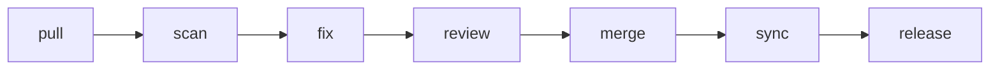

# ghs-orchestrate

Run a full maintenance pipeline across repositories --- update, scan, fix, review, merge, sync, and optionally release.

::: info Skill Info
**Version:** 1.0.0
**Arguments:** `[owner/repo...] [--stages pull,scan,fix,review,merge,sync,release] [--dry-run] [--resume]`
**Trigger phrases:** "orchestrate", "run pipeline", "maintain my repos", "full pipeline", "scan and fix all repos", "process all repos", "pipeline for {repo}", "maintenance run", "end-to-end maintenance"
:::

## What It Does

`ghs-orchestrate` chains existing ghs-skills into a sequential pipeline for end-to-end repository maintenance. It manages the lifecycle across one or many repositories, with human checkpoints before destructive stages and state issue-based resume from interruption.

### Pipeline Stages



| Stage | Skill | Destructive? | Checkpoint? |
|-------|-------|-------------|-------------|
| pull | ghs-repos-pull | No | No |
| scan | ghs-repo-scan | No | No |
| fix | ghs-backlog-fix | Yes (creates PRs) | Yes |
| review | ghs-review-pr | No | No |
| merge | ghs-merge-prs | Yes (merges PRs) | Yes |
| sync | ghs-backlog-sync | No | No |
| release | ghs-release | Yes (creates tag) | Yes |

Stages 3 (fix), 5 (merge), and 7 (release) are destructive and require human confirmation unless `--no-checkpoint` is set.

### Scope Boundary

**Only orchestrates** --- delegates all work to existing skills. Never directly modifies code, creates PRs, or calls the GitHub API for mutations.

### Process

1. **Parse input** --- Determine repo list, stage range, and flags
2. **Pre-flight** --- Verify auth, git, skill availability, archived repos
3. **Load state** --- Read state issue (GitHub Issue with `ghs:state` label) for resume from previous runs
4. **Show plan** --- Display pipeline plan, wait for confirmation
5. **Execute** --- Process each repo sequentially through pipeline stages
6. **Write state** --- Update state issue with session results
7. **Summary** --- Final dashboard with all repos and their status

### Input Modes

| Mode | Trigger | Example |
|------|---------|---------|
| Multi-repo (all) | "maintain my repos" | Process all repos with a GitHub Project |
| Multi-repo (list) | "pipeline for repo1, repo2" | Process specified repos |
| Single-repo | "pipeline for owner/repo" | Full pipeline for one repo |
| Partial pipeline | `--from scan --to fix` | Only run stages in range |

### Flags

| Flag | Default | Effect |
|------|---------|--------|
| `--dry-run` | off | Show plan without executing |
| `--release` | off | Include the release stage (opt-in) |
| `--no-checkpoint` | off | Skip confirmation before destructive stages |
| `--from {stage}` | `pull` | Start pipeline at this stage |
| `--to {stage}` | `sync` | Stop pipeline after this stage |

## Example

```
## Pipeline: Multi-Repo Maintenance

Mode: multi-repo (2 repos)
Stages: pull -> scan -> fix -> merge -> sync

| Repo | pull | scan | fix | review | merge | sync | Status |
|------|------|------|-----|--------|-------|------|--------|
| phmatray/Formidable | [PASS] | [PASS] 8 items | [PASS] 5 fixed, 3 PRs | [PASS] | [PASS] 3 merged | [PASS] | Complete |
| phmatray/OtherRepo | [PASS] | [PASS] 0 items | --- (nothing to fix) | --- | --- | [PASS] | Complete |

---

Summary:
  Repos processed: 2
  Fully completed: 2
  PRs created: 3
  PRs merged: 3

  Score changes:
    phmatray/Formidable: 45% -> 82% (+37)
    phmatray/OtherRepo: 91% (no change)

To view updated dashboard: /ghs-backlog-board
```

### Resume from Interruption

If a previous pipeline run was interrupted, the state issue enables resume:

```
Previous orchestration run detected for phmatray/Formidable:
  Started: 2026-02-28
  Completed stages: pull, scan
  Next stage: fix

Resume from fix? (y/resume/fresh)
```

## Routes To

- **[ghs-backlog-board](/skills/ghs-backlog-board)** --- view updated dashboard after pipeline

## Routes From

- **[ghs-backlog-board](/skills/ghs-backlog-board)** --- start pipeline from dashboard
- **[ghs-backlog-next](/skills/ghs-backlog-next)** --- pipeline after recommendation

## Technical Details

| Property | Value |
|----------|-------|
| Allowed tools | `Bash(gh:*)`, `Bash(git:*)`, `Read`, `Write`, `Edit`, `Glob`, `Grep`, `Skill` |
| Spawns sub-agents | No --- delegates to individual skills via Skill tool |
| Stages | 7 (pull, scan, fix, review, merge, sync, release) |
| Bias guards | Sunk cost, Completion, Automation, Anchoring |
| Requires | `gh` CLI (authenticated), `git`, all ghs-skills, GSD framework (for fix stage) |
