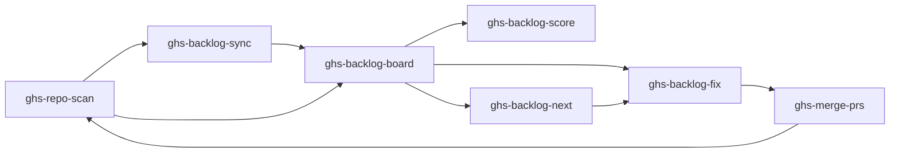
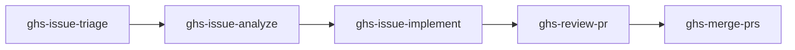
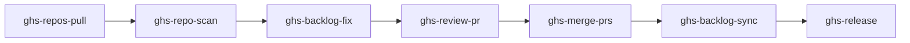

# Skills Reference

GHS provides **18 skills** organized into workflow loops, action skills, orchestration modes, and utilities.

::: tip Start Here
New to GHS? Start with [ghs-repo-scan](/skills/ghs-repo-scan) --- it's the entry point for everything else.
:::

## Health Loop

The health loop audits repositories against 43 quality checks, stores findings as GitHub Project items, optionally promotes them to GitHub Issues for team visibility, displays findings on a dashboard, fixes them with parallel agents, and merges the resulting PRs.

## Issue Loop

The issue loop classifies GitHub issues with labels, investigates the codebase for each issue, implements fixes with worktree-based agents, reviews the PRs, and merges them.

## Orchestration Pipeline

The orchestration pipeline chains skills end-to-end across one or many repositories, with human checkpoints before destructive stages and state issue-based resume.

## All Skills

| Skill | Category | Arguments | Description |
|-------|----------|-----------|-------------|
| [ghs-repo-scan](/skills/ghs-repo-scan) | <Badge type="health" text="Health" /> | `[owner/repo]` | Scan a repo for quality best practices and open issues |
| [ghs-backlog-sync](/skills/ghs-backlog-sync) | <Badge type="health" text="Health" /> | `[owner/repo] [--dry-run]` | Promote draft project items to GitHub Issues for team visibility |
| [ghs-backlog-board](/skills/ghs-backlog-board) | <Badge type="health" text="Health" /> | `[--sort score\|progress\|name]` | Dashboard of all backlog items across audited repos |
| [ghs-backlog-fix](/skills/ghs-backlog-fix) | <Badge type="health" text="Health" /> | `[owner/repo] [--item] [--dry-run]` | Fix backlog items using parallel worktree agents |
| [ghs-backlog-score](/skills/ghs-backlog-score) | <Badge type="health" text="Health" /> | `[owner/repo]` | Calculate and display health score |
| [ghs-backlog-next](/skills/ghs-backlog-next) | <Badge type="health" text="Health" /> | `[owner/repo]` | Recommend highest-impact next fix |
| [ghs-profile](/skills/ghs-profile) | <Badge type="info" text="Profile" /> | `[username]` | 360-degree view of a GitHub user's presence |
| [ghs-issue-triage](/skills/ghs-issue-triage) | <Badge type="issue" text="Issue" /> | `[owner/repo] [--all] [--auto]` | Apply proper labels to GitHub issues |
| [ghs-issue-analyze](/skills/ghs-issue-analyze) | <Badge type="issue" text="Issue" /> | `<owner/repo#number>` | Deep-analyze an issue, post analysis comment |
| [ghs-issue-implement](/skills/ghs-issue-implement) | <Badge type="issue" text="Issue" /> | `<owner/repo#number>` | Implement an issue, create a PR |
| [ghs-review-pr](/skills/ghs-review-pr) | <Badge type="action" text="Review" /> | `[owner/repo] [--pr <number>]` | Review a PR with structured findings by severity |
| [ghs-release](/skills/ghs-release) | <Badge type="action" text="Release" /> | `[owner/repo] [--bump] [--dry-run]` | Create a GitHub Release with auto-generated changelog |
| [ghs-project-init](/skills/ghs-project-init) | <Badge type="action" text="Setup" /> | `<name> [--template <stack>]` | Scaffold a new repo targeting 100% health score |
| [ghs-action-fix](/skills/ghs-action-fix) | <Badge type="action" text="Action" /> | `[owner/repo] [--workflow]` | Fix failing GitHub Actions pipelines directly |
| [ghs-merge-prs](/skills/ghs-merge-prs) | <Badge type="action" text="Both" /> | `[owner/repo] [--all] [--dry-run]` | Merge PRs with CI-aware confirmation |
| [ghs-orchestrate](/skills/ghs-orchestrate) | <Badge type="warning" text="Orchestration" /> | `[owner/repo...] [--stages] [--dry-run]` | Multi-repo maintenance pipeline with checkpoints |
| [ghs-dev-loop](/skills/ghs-dev-loop) | <Badge type="warning" text="Orchestration" /> | `[owner/repo] [--budget] [--cycle]` | Autonomous developer for a single repo |
| [ghs-repos-pull](/skills/ghs-repos-pull) | <Badge type="tip" text="Utility" /> | `(no arguments)` | Pull all cloned repos to keep them fresh |
