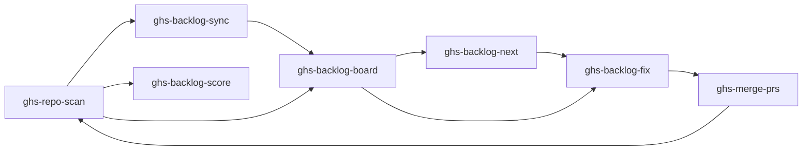

# Health Loop

The Health Loop is GHS's core workflow for improving repository quality through continuous scanning and fixing.

## The Loop



## Step by Step

### 1. Scan
"Scan my repo" --- runs health checks + fetches open issues. Produces a scored report and creates findings as GitHub Project items in the repository's GHS project.

### 2. Sync (optional)
"Sync backlog" --- publishes health findings as GitHub Issues with labels (`ghs:health-check`, `tier:N`, `category:*`) and links them to the GitHub Project. Makes findings visible to collaborators through GitHub's native UI. Title-based dedup prevents duplicates on re-sync.

### 3. Review
"Show me the backlog board" --- see all audited repos, their scores, and outstanding project items. Synced items show their GitHub issue reference. Or "what's the score?" for a quick number.

### 4. Prioritize
"What should I fix next?" --- GHS recommends the highest-impact item using: lowest-score repo, then health over issues, then lowest tier, then highest points.

### 5. Fix
"Fix the backlog" --- parallel agents create worktrees, fix items, and create pull requests. When items have synced issues, PRs include "Fixes #N" for auto-close. Items are categorized:
- **Category A**: API-only (repo settings) --- no worktree needed
- **Category B**: File changes --- one worktree per item
- **Category CI**: CI diagnosis --- special handling

### 6. Merge
"Merge my PRs" --- sequentially merges open PRs with CI-aware checks. Bot PRs get squashed, human PRs get regular merge. Synced issues auto-close when their "Fixes #N" PR merges.

### 7. Repeat
Rescan to measure improvement. Target: 100% score (67/67 points). Re-syncing closes issues for checks that now pass and updates project item status accordingly.

## Example Session

A realistic conversation flow:

```
You: scan phmatray/my-project
GHS: [scan output with score 45/67 (67%)]

You: sync backlog phmatray/my-project
GHS: [creates 10 GitHub Issues and links them to the GHS project]

You: what should I fix next?
GHS: [recommends "Repository description is empty" - Tier 1, 4 points, Issue #42]

You: fix the backlog
GHS: [creates PRs with "Fixes #N" for auto-close]

You: merge my PRs
GHS: [merges 5 PRs, synced issues auto-close]

You: scan phmatray/my-project
GHS: [new score 62/67 (93%)]
```
