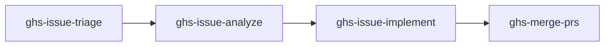

# Issue Loop

The Issue Loop handles GitHub issue management --- from labeling through implementation.

## The Loop

## Step by Step

### 1. Triage
"Triage my issues" --- ensures a 15-label taxonomy exists (7 type, 4 priority, 4 status), classifies all open issues, and applies labels after confirmation.

Labels created:
- Type: bug, feature, enhancement, documentation, chore, question, discussion
- Priority: critical, high, medium, low
- Status: needs-triage, ready, in-progress, blocked

### 2. Analyze
"Analyze issue #123" --- deep-dives into the codebase, produces a structured analysis (feasibility, complexity, effort, risk), and posts it as a GitHub comment.

### 3. Implement
"Implement issue #123" --- spawns agents in worktrees to implement fixes, creates PRs linked to the issue.

### 4. Merge
"Merge my PRs" --- same as the health loop. Completes the cycle.

## When to Use Each Skill

| Situation | Skill |
|-----------|-------|
| New repo, many unlabeled issues | ghs-issue-triage |
| Complex issue, need to understand scope | ghs-issue-analyze |
| Clear issue, ready to code | ghs-issue-implement |
| PRs ready to merge | ghs-merge-prs |
